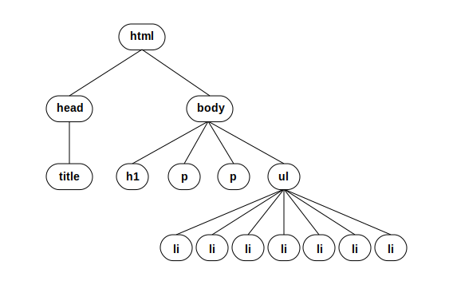

# JavaScript in class exercise

Welcome to programming. Up until now you have been dealing exclusively with markup languages and stylesheets. JavaScript is a full fledged programming language. While it was originally designed to augment webpages, it is used in a variety of ways to on and off the web. In fact Brackets, the text editor we have been using is written in JavaScript.

##Part 1

This first part can be done completely in the **JavaScript console** inside any browser, on any webpage. 

To open the JavaScript console:
  * **Chrome** Go to *View>Developer>JavaScript Console*
  * **Firefox** Go to *Tools>Web Developer>Web Console*

### Statements
* Enter `alert("Hello World!");` into the JavaScript console and hit return.
* Enter any number. What happens?
* Enter `2 + 4`. What happens?
* Try some other simple math equations and see what happens.
* Enter `document.write("Hello World")` What happens.
* Refresh the page.
* Here is something more complex. We will talk about the details later.

```javascript
document.getElementsByTagName("h1")[0].textContent
```

For now just see what it does. Don't worry if you get an error.

### Variables

Variables are what make programs flexible tools. If we could only enter numbers directly we couldn't change what a program does with different input.

Lets create our first variable.

* Write the following in the console. `var x = 3;` Hit return. This creates the variable x and assigns it the value 3.
* Enter `x` and hit return. You should see its value print out.
* Let's declare another variable: `var greeting = "Hello!";`
* Enter `greeting` and hit return. What do you see?
* Create another variable `y`. Assign it the value of `x` by typing `y = x`.
* Check `y`'s value.
* Assign the variable `x` the value 5. 
* What is the value of `x` and `y` now? Can you explain to your partner what happened?

### Operators

Once you have variables you will want to do something with them.

* Enter `var sum = x + y`. We can create new variables and assign them the results of operations like this.
* Use `-` operator to subtract  `x` and `y` and assign it to the variable `difference`.
* Use `*` operator to multiply `5` and `y` and assign it to the variable `product`.
* Use `/` operator to divide `9` and `4` and assign it to the variable `quotient`.
* Enter `var result = 9 % 4`.
* Can you figure out what the `%` operator(also know as modulo) does? Try other values. *HINT: It has something to do with division.*

#### Using operators on strings

* Using what you know create a variable called `foo` and assign it the value `"Hello"`
* Create a variable called `bar` and assign it the value `"World!"`
* Type `foo + bar`. What happens?
* How can you make the words print out correctly?

That is a very quick introduction to variables and operators. We will continue to use them in a little bit as we go deeper.

Now lets work with JavaScript from within an HTML document. 

* Open the `index.html` document included in this repository in Brackets.

It should contain the basic HTML tags we have seen before.  Lets start by recreating our "Hello world" example from above. 

First we need a place for our JavaScript in the document. Normally you want to load the JavaScript last, after the CSS and most of the HTML has loaded. This way viewers will see the main content first. 

Just before the closing `</body>` tag, enter the following:

```javascript
<script>

alert("Hello world");

</script>
```

Normally we will place our JavaScript in a separate file, but today we will just embed it in the HTML document. We will be placing all our code today between these script tags. 

* Open the page in the browser or if you already have, reload it. Open the JavaScript console as we did in Part I.

*Keep in mind that Live Preview in Brackets won't work with the JavaScript console open.*

## Conditionals

Conditionals allow us to branch our code. Doing one thing if something is true and another if it is false.

Replace the contents of the `<script>` tag with the following:

```javascript
var myNumber = 3;

if ( myNumber == 3 ) {
  alert("Its true!");
}
```

This statement evaluates whether `myNumber` equals 3, if it does, we popup an alert message. Note that there are two equal signs between `myNumber` and 3.

Before we go on lets switch the code to the following:

```javascript
var myNumber = 3;

if ( myNumber == 3 ) {
  console.log("Its true!");
} else {
  console.log("Its false");
}
```

The else clause allows us to run different code if the answer is false. Sending messages to the Javascript console is a little less annoying than an alert window. Now make sure the JavaScript console is open and reload the page.

Lets try out some different conditionals statements. Replace the if statement with the following. Be sure to reload the page after each. Make sure you can explain why you got each result.

* `if( 5 > 2 )` Unless the laws of mathematics change this would always be true.
* `if( 5 < 2 )` This one would always be false.
* `if( myNumber >= 0 )` Use `>=` or `<=` to test greater/less than or equal.
* `if( myNumber == 3 )` Use `==` to test if two things are equal.
* `if( myNumber != 3 )` Use `!=` to test if two things are NOT equal. 
* `if( myNumber = 21 )` Why does this evaluate as true? HINT: Check the value of myNumber.
* Write a statement that tests if myNumber is greater than or equal to 10.

You can also use comparisons between Strings

What happens when you enter the following conditionals?

* `if("Hello" == "Goodbye")`
* `if("Alligator" < "Baracuda")`
* `if(myNumber == "telephone")`
* `if(myNumber == "3")`

## Loops

Loops keep us from writing the same code over and over again. Replace the contents of the `<script>` tag with the following, save and reload:

```javascript
var index = 0;

while( index < 10 ) {
  console.log(index);
  index = index + 1;
}
```

* What does this code do?
* Can you change it to include the number 10?
* Change it to list just even numbers.
* Change it to go from 4 to 20.

Now replace the contents of the `<script>` tag with the following:

```javascript
  for(var index = 0; index < 10; index++) {
    console.log(index);
  }
```

* What does this code do?
* Change it to include the number 10.
* Change it to list just even numbers.
* Change it to list from -3 to 17?
* Can you make the loop go from 20 down to 0.

###STOP
#### We will cover Part III in a little bit

---

## Part III: Conditionals, loops, and functions

## Arrays

 Arrays are a list of variables that are accessed via an index. They can contain any value a variable can. Here is an array with the names of fruits

```javascript
  var fruit = ["Apples", "Bananas", "Oranges", "Kiwi"];
```

To access an element of an array we use the name followed by square brackets containing the index of the element we want. `fruit[0]` would access the first element whose value is "Apples". Arrays always start at zero.

Loops are much more powerful when you add arrays. Replace the code with the following:

```javascript
  var fruit = ["Apples", "Bananas", "Oranges", "Kiwi"];

  for(var index = 0; index < 4; index++) {
    console.log(fruit[index]);
  }  
```

* What happens when you run this code?
* What happens when you change `index < 4` to `index < 10`?
* You can use `fruit.length` to see how many values the array `fruit` holds. Plug it in where you now have the value `10`. Run the code again.
* Create a new array with a list of values of your choosing. Print it out to the console just as you have here.

Sometimes you may want to create an array before you add values to it. There are several ways to do so. 

```javascript
var arrayName = [];
```

or

```javascript
var arrayName = new Array();
```

Replace the contents of the `<script>` tag with this: 

```javascript
  var squares = [];
 
  for(var index = 0; index < fruit.length; index++) {
    squares[index] = index * index;
  }
```

## Functions

Functions make it easier to deal with code that you might use again and again.

```javascript
  function hello(name) {
    console.log("Hello " + name);
  }
  
  hello("Fred");
```

Functions can do more than just save chunks of code. They can return values to be used elsewhere.

```javascript
  function square( x ) {
    return x * x;
  }
  
  var twoSquared = square(2);
```

* What does this code do?

Functions can take in more than one variable or no variables at all.

```javascript
  function add(a, b) {
    return a + b;
  }
  
  var twoPlusTwo = add(2, 2);
```

* What does this code do?
* Write your own function that returns a value based on an input(s)...

## Objects

Objects like arrays, let you store more than one value in a single variable but can allow you to name those values and even add functions (will talk about these in a minute) to the variable. Even if you don't create your own objects you will use objects all the time in JavaScript.

Instead of this:

```javascript
  var artistName = "Barry";
  var artistMedium = "Painting";
  var artistAge = 32;
```

I could create an object that holds all of that information.

```javascript
  var artist = { name: "Barry", medium: "Painting", age: 32 };
```  

Notice that instead of square brackets we are using curly braces around objects. You can access the values of the object by using square brackets(similar to arrays) or using dot notation. We will primarily use dot notation.

```javascript
artist["name"]

artist.name
```
You will see dot notation frequently. It can be used to refer to an objects properties (variables) or its methods (functions that run code).

## Document Object Model

We have covered a lot of ground today. Before we finish I want to introduce an important part of using JavaScript to enhance webpages: the Document Object Model or DOM. The DOM is a way of representing the webpage (in this case index.html) within JavaScript. It allows us to see what is on the page and to add or change both HTML and CSS. We already uses a little piece of the DOM earlier when we entered the following:

```javascript
document.getElementsByTagName("h1")[0].textContent
```

Lets start with that first part `document`. This is an *object* that is available whenever you use JavaScript in a browser. It represents the current document or webpage (index.html).

The document is stored as tree with a node for each element of the page. For `index.html` it looks something like this. 



There is actually a lot more nodes that you cannot see here, but these are the ones we will focus on. You can see that each node is a child of the node that it is nested inside. The `title` node is the child of the `head` node because the `<title>` tag is nested inside the `<head>` tag.


### Access parts of the DOM

The `document` object has many methods and properties to access and change this tree of nodes. One method is `getElementsByTagName(tag)`. This method (or function) will grab all the elements of the page of a certain tag and returns them in an array.

Lets give it a try. Start by replacing the contents of the `<script>` tag with this:

```
var paragraphs = document.getElementsByTagName("p");
```

This will save the array that `getElementsByTagName` returns into a new variable paragraphs. This array holds all the paragraph nodes in the document. Lets look at the first paragraph in the array. Add the next line:

```
console.log(paragraphs[0]);
```
This should print out the tag and text of the first paragraph. If we want just the text inside we can reference the `textContent` property of the node. You can use the dot notation like this.

```
console.log(paragraphs[0].textContent);
```

Now lets try to combined some of what we learned earlier. 

* Create a for loop that loops through the `p` nodes in `paragraphs` array and prints them out to the console.


### Change parts of the DOM

We can use these nodes not just to view the contents of nodes but to change them. Try this.

```
paragraphs[0].textContent = "It was the best of times, it was the worst of time."
```

### Add elements to the page

Adding elements to the page is a two part process.

1. Create the new element
2. Find the element we want to add it to.
2. Append the new element to the DOM.

First lets create a new paragraph:

```
var newParagraph = document.createElement("p");
var paragraphContents = document.createTextNode("Something new and different.");
newParagraph.appendChild(paragraphContents);
```

The document object in addition to hold the DOM tree has methods(functions) for creating new elements. Here we are creating a new `<p>` tag and appending some text to it. The contents of a tag are represented as a child node of the tag. This new element is not part of the DOM yet however. Lets add it to the tree.

Next lets grab the body node.

```
var bodyTags = document.getElementsByTagName("body");
var body = bodyTags[0];
```

First we grabbed the array of body tags (`bodyTags`). Then we grab the first element of that array and assign it to the variable `body`. We can actually shorten this series of tags if we want.

``` 
var body = document.getElementsByTagName("body")[0];
```

Now we need to append the new paragraph to the body. This is the same process as adding the text node.

```
body.appendChild(newParagraph);
```

That is a lot of work to just create what we could much more simply create in HTML. The advantage is we can now change any part of our webpage at anytime we want. We will get to that timing next week.

To put it all together here is what we just did:


```
//Create new paragraph element.
var newParagraph = document.createElement("p");
var paragraphContents = document.createTextNode("Something new and different.");
newParagraph.appendChild(paragraphContents);

//Find the body tag in the DOM
var body = document.getElementsByTagName("body")[0];

//Add our new paragraphy to the body tag
body.appendChild(newParagraph);
```


